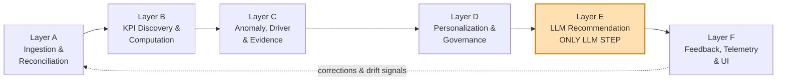

<div align="center">

# RootLens AI

### KPI Intelligence-to-Action Engine

**From KPI movement to evidence-backed, confidence-aware business action.**


**Accenture Innovation Challenge 2026 · Round 2 · BusinessIntelligence.ai**  
**Team CreativeChaos · IIT Patna**

</div>

---

## Overview

Enterprise dashboards are good at showing **what changed**. The harder questions come next:

- **Why did the KPI move?**
- **Which drivers actually explain the movement?**
- **What evidence supports that explanation?**
- **How confident should we be?**
- **What should this specific decision-maker do next?**

**RootLens AI** is a governed KPI Intelligence-to-Action Engine that turns heterogeneous enterprise data into trustworthy, persona-specific recommendations.

Its central design rule is simple:

> **Every KPI, trend, anomaly, driver and confidence score is produced by deterministic logic, statistics or traditional ML. The LLM never sees raw data; it receives only a pre-verified evidence package and phrases the final recommendation.**

```text
TRUTH         → deterministic analytics
EVIDENCE      → traceable support and context
CONFIDENCE    → explain, caveat, or abstain
COMMUNICATION → one final LLM step
ACTION        → persona-specific recommendation
```

---

## Why RootLens AI

| Enterprise challenge | RootLens capability | Business outcome |
|---|---|---|
| Fragmented data and inconsistent KPI definitions | Governed ingestion, profiling, semantic contract and canonical model | Consistent KPI truth |
| Too many KPI alerts | Materiality + anomaly detection | Focus on movements that matter |
| Slow root-cause investigation | Driver decomposition and ranked contribution analysis | Faster diagnosis |
| Generic AI explanations | Evidence ledger + confidence scoring | Traceable, reviewable reasoning |
| Hallucination risk | Deterministic quantitative pipeline | LLM cannot create numerical truth |
| Weak or contradictory evidence | Confidence gate + abstention | System can refuse to guess |
| Different stakeholder needs | Persona-aware output + scoped access | Same truth, different decisions |
| Unclear GenAI economics | Runtime telemetry | Visible latency, calls and cost |

---

## Core Design Principles

| Principle | What it means in practice |
|---|---|
| **LLM is never the source of truth** | Numbers come from rules, statistics and ML — never from model inference |
| **The LLM speaks last** | It receives a verified evidence package only after analytical validation |
| **Determinism = reproducibility** | Same input + same configuration → same analytical output |
| **Every insight is traceable** | Findings carry method, evidence, confidence and lineage |
| **Uncertainty is explicit** | Low-confidence cases can caveat or abstain instead of forcing an answer |
| **Security is applied before communication** | Persona scope is enforced before sensitive data reaches downstream stages |

---

## System Architecture



| Layer | Purpose | Main backend modules |
|---|---|---|
| **A — Ingestion & Reconciliation** | Unify multi-source data into one governed analytical model | `ingestion/`, `profiling/`, `semantic/`, `quality/`, `canonical/` |
| **B — KPI Discovery & Computation** | Discover, validate, compute and prioritize KPIs | `kpi_engine/` |
| **C — Anomaly, Driver & Evidence** | Detect what moved, explain why, attach evidence and score confidence | `anomaly/`, `drivers/`, `evidence/`, `confidence/` |
| **D — Personalization & Governance** | Apply persona/access rules and deterministic insight structure | `persona/`, `insight_templates/`, `recommendation/` |
| **E — LLM Recommendation** | Convert verified evidence into persona-appropriate recommendation language | `llm/` |
| **F — Feedback, Telemetry & UI** | Capture corrections, observe runtime behavior and present decisions | `feedback/`, `telemetry/` |

---

## End-to-End Run Test

The prototype is designed around one judge-friendly action: **Run Test**.

```text
Select data / KPI / persona / scope
              ↓
           RUN TEST
              ↓
      Profile & reconcile data
              ↓
       Compute / validate KPI
              ↓
  Detect material movement / anomaly
              ↓
      Rank explanatory drivers
              ↓
       Attach traceable evidence
              ↓
       Score confidence level
          ↙             ↘
      ABSTAIN          CONTINUE
    (no LLM call)     (verified package)
                           ↓
                    Final LLM phrasing
                           ↓
                 Persona-specific action
                           ↓
                        Telemetry
```

A strong test run should make the reasoning inspectable rather than merely display a generated paragraph.

### What the user should be able to inspect

- KPI value, trend and materiality
- anomaly / structural-change signal
- ranked explanatory drivers
- contribution or analytical method used
- supporting evidence and lineage
- confidence level and caveats
- persona-specific recommendation
- owner / next action / monitoring plan
- runtime telemetry

---

## Analytical Pipeline

### 1. Ingestion & Profiling

RootLens accepts heterogeneous enterprise inputs and profiles them before analysis.

Key responsibilities:

- schema and type inspection
- missing-value and duplicate checks
- categorical consistency checks
- source metadata capture
- data-quality issue logging
- dataset and source identifiers

Raw problems are **logged and governed**, not silently hidden.

### 2. Semantic Contract & Canonical Model

KPI definitions, formulas, thresholds, drivers, lineage and access rules belong in a governed semantic layer instead of being scattered across UI or model prompts.

This gives RootLens a reproducible rulebook for:

- what each KPI means
- how it is calculated
- which dimensions and drivers are valid
- what constitutes a material movement
- which personas are allowed to see which information

### 3. KPI Intelligence

The KPI engine computes and validates KPI candidates before downstream analysis.

No LLM is involved in KPI computation.

### 4. Anomaly & Change Detection

The analytics layer uses deterministic statistical methods to detect meaningful changes rather than treating every fluctuation as a business event.

Current stack support includes:

- statistical baselines
- robust anomaly statistics
- time-series analysis
- change-point detection with **Ruptures**
- business materiality thresholds

### 5. Driver Analysis

RootLens moves beyond “anomaly detected” and asks **what explains the movement?**

Driver analysis can use deterministic, explainable methods such as:

- contribution decomposition
- dimensional drill-down
- regression / association analysis
- statistical comparison across candidate factors

Driver language remains appropriately cautious: association is not presented as causal proof unless the analytical design supports that claim.

### 6. Evidence & Confidence

Each insight is paired with supporting evidence and a confidence decision.

A confidence score can combine factors such as:

- statistical strength
- data completeness / quality
- agreement across analytical methods
- supporting vs. contradictory evidence
- evidence freshness and lineage

```text
HIGH confidence   → explain and recommend
MEDIUM confidence → explain with caveats
LOW confidence    → abstain / request review
```

**Low-confidence path = zero LLM calls.**

### 7. Persona-Aware Recommendation

The analytical truth remains fixed; the **decision framing** changes by persona.

Examples:

| Persona | Typical scope | Output emphasis |
|---|---|---|
| Frontline / Operations | Local operational scope | Immediate tactical actions |
| Regional Manager | Assigned region | Drivers, controllable levers, short-term intervention |
| Executive / HQ | Enterprise-wide | Strategic impact, prioritization and monitoring |

### 8. Feedback & Telemetry

The system captures user feedback and runtime observability so recommendations are not treated as an unreviewed black box.

Telemetry can include:

- stage-level latency
- number of LLM calls
- token usage
- estimated model cost
- feedback / correction events

---

## LLM vs. Non-LLM Ledger

| Stage | Primary method | LLM used? |
|---|---|---:|
| Ingestion / profiling | Python rules + validation | No |
| Semantic contract | Deterministic configuration | No |
| KPI computation | Rules / statistics | No |
| Anomaly detection | Statistical / change-point methods | No |
| Driver analysis | Contribution / statistical analysis | No |
| Evidence assembly | Deterministic evidence pipeline | No |
| Confidence scoring | Weighted deterministic logic | No |
| Abstention | Rule-based confidence gate | No |
| Deterministic insight structure | Templates | No |
| **Recommendation phrasing** | **LLM over verified evidence package** | **Yes** |

> **The LLM communicates the analytical truth; it does not create it.**

---

## Tech Stack

### Backend

| Area | Technology |
|---|---|
| Runtime | **Python 3.11** |
| API | **FastAPI + Uvicorn** |
| Data / Analytics | **Pandas, NumPy, SciPy, Statsmodels** |
| Change-point detection | **Ruptures** |
| Validation / Schemas | **Pydantic v2** |
| Storage | **SQLite (`sqlite3`, no ORM)** |
| Upload handling | **python-multipart** |
| Environment configuration | **python-dotenv** |
| Testing | **pytest + httpx** |

### Frontend

| Area | Technology |
|---|---|
| UI | **React 18** |
| Build tool | **Vite** |
| Language | **TypeScript** |
| Styling | **Tailwind CSS** |
| Charts | **Recharts** |
| API client | **Native `fetch`** |

### LLM

- **Anthropic Claude API** via the `anthropic` Python SDK
- API key loaded from `.env` as `ANTHROPIC_API_KEY`
- Used only in the final recommendation stage

### Deliberately Out of Scope for the Prototype

- Docker
- ORM layer
- production authentication provider
- production SSO / OAuth

Persona-based access control in this prototype is **application-level authorization logic**, not a replacement for real enterprise authentication.

---

## Repository Structure

```text
kpi-intelligence-engine/
├── backend/
│   ├── app/
│   │   ├── main.py                     # FastAPI app / CORS / routers
│   │   ├── config.py                   # environment configuration
│   │   ├── db.py                       # SQLite connection helper
│   │   ├── api/                        # thin HTTP route handlers
│   │   │   ├── health.py
│   │   │   ├── ingestion.py
│   │   │   ├── profiling.py
│   │   │   ├── semantic_contract.py
│   │   │   ├── data_quality.py
│   │   │   ├── canonical_model.py
│   │   │   ├── kpi.py
│   │   │   ├── anomaly.py
│   │   │   ├── drivers.py
│   │   │   ├── evidence.py
│   │   │   ├── persona.py
│   │   │   ├── insights.py
│   │   │   ├── recommendations.py
│   │   │   ├── feedback.py
│   │   │   └── telemetry.py
│   │   ├── core/                       # framework-agnostic business logic
│   │   │   ├── ingestion/
│   │   │   ├── profiling/
│   │   │   ├── semantic/
│   │   │   ├── quality/
│   │   │   ├── canonical/
│   │   │   ├── kpi_engine/
│   │   │   ├── anomaly/
│   │   │   ├── drivers/
│   │   │   ├── evidence/
│   │   │   ├── confidence/
│   │   │   ├── persona/
│   │   │   ├── insight_templates/
│   │   │   ├── recommendation/
│   │   │   ├── llm/
│   │   │   ├── feedback/
│   │   │   └── telemetry/
│   │   └── models/                     # shared Pydantic schemas
│   ├── tests/                          # mirrors core modules
│   ├── data/
│   │   ├── uploads/
│   │   └── app.db
│   ├── requirements.txt
│   └── .env.example
├── frontend/
│   ├── src/
│   │   ├── main.tsx
│   │   ├── App.tsx
│   │   ├── pages/
│   │   │   ├── UploadPage.tsx
│   │   │   ├── ProfilePage.tsx
│   │   │   ├── SemanticContractPage.tsx
│   │   │   ├── DataQualityPage.tsx
│   │   │   ├── CanonicalModelPage.tsx
│   │   │   ├── KpiDashboardPage.tsx
│   │   │   ├── AnomalyPage.tsx
│   │   │   ├── DriversPage.tsx
│   │   │   ├── ConfidencePage.tsx
│   │   │   ├── InsightsPage.tsx
│   │   │   ├── RecommendationsPage.tsx
│   │   │   ├── FeedbackPage.tsx
│   │   │   ├── TelemetryPage.tsx
│   │   │   └── DashboardPage.tsx
│   │   ├── components/
│   │   ├── api/
│   │   └── types/
│   ├── package.json
│   ├── tailwind.config.js
│   └── vite.config.ts
└── docs/
    ├── KPI_Engine_Final_Architecture.md
    └── kilo-build-plan/
```

### Naming Conventions

- `core/<module>/` contains framework-independent logic.
- `api/<name>.py` stays thin and delegates to `core/`.
- Each core module should have a matching backend test module.
- Frontend API wrappers mirror backend API domains.
- Shared frontend types should match backend Pydantic response contracts.
- IDs use UUID strings rather than row positions or filenames.

---

## Getting Started

### Prerequisites

- Python **3.11**
- Node.js + npm
- An Anthropic API key for the final LLM stage

### 1. Clone the repository

```bash
git clone <YOUR_REPOSITORY_URL>
cd kpi-intelligence-engine
```

### 2. Start the backend

```bash
cd backend
python -m venv .venv
```

Activate the environment:

**Windows**

```bash
.venv\Scripts\activate
```

**macOS / Linux**

```bash
source .venv/bin/activate
```

Install dependencies:

```bash
pip install -r requirements.txt
```

Create your local environment file from `.env.example` and add:

```env
ANTHROPIC_API_KEY=your_key_here
```

Run the API:

```bash
uvicorn app.main:app --reload
```

### 3. Start the frontend

Open a second terminal:

```bash
cd frontend
npm install
npm run dev
```

Open the local Vite URL displayed in the terminal.

---

## Testing

Backend tests are written with **pytest** and **httpx**.

From `backend/`:

```bash
pytest
```

Recommended test coverage areas:

- schema and semantic-contract validation
- KPI computation
- anomaly / change detection
- driver ranking
- confidence and abstention paths
- persona restrictions
- recommendation payload validation
- feedback persistence
- telemetry logging

---

## Security & Governance

RootLens is designed to keep governance visible rather than implicit.

### Prototype controls

- persona-based scope restrictions
- sensitive-field filtering
- deterministic KPI definitions
- explicit confidence and abstention
- method / evidence / lineage visibility
- no raw-data reasoning by the final LLM
- model usage telemetry

### Important boundary

The prototype's persona logic is **authorization behavior for demonstration**, not a production authentication system.

A production deployment would move identity and access enforcement to enterprise-grade SSO/OAuth and warehouse-level row/column security.

---

## Alignment with AIC Round 2 — BusinessIntelligence.ai

| Round 2 expectation | RootLens implementation |
|---|---|
| Detect and prioritize material KPI movements | KPI materiality + anomaly engine |
| Reconcile heterogeneous enterprise data | Ingestion, profiling, data quality and canonical model |
| Identify and rank explanatory drivers | Deterministic driver analysis |
| Produce persona-specific narratives | Persona layer + final LLM phrasing |
| Communicate uncertainty and abstain | Confidence engine + explicit abstention path |
| Recommend practical business actions | Verified recommendation evidence package |
| Learn from analyst / user feedback | Feedback module and correction loop |
| Respect security, latency and cost constraints | Scoped access + telemetry + one final LLM stage |
| Show evidence freshness, method, contribution, confidence and lineage | Evidence / confidence ledger |
| Clearly separate LLM and non-LLM processing | Explicit processing ledger above |
| Show runtime telemetry | Telemetry module |

---

## Demo Strategy

The strongest demo is one continuous investigation rather than a feature tour:

```text
KPI movement
   ↓
materiality / anomaly
   ↓
ranked drivers
   ↓
evidence
   ↓
confidence
   ↓
persona-specific action
   ↓
telemetry
```

Recommended recording sequence:

1. Run one **high-confidence, multi-factor** case.
2. Inspect ranked drivers and evidence.
3. Show that the LLM only appears after verification.
4. Switch persona on the same underlying analytical truth.
5. Run one **low-confidence** case and show abstention.
6. Finish on telemetry and the final decision workspace.

---

## Limitations

RootLens AI is a competition prototype, not a production enterprise deployment.

Current limitations include:

- driver association does not automatically prove causation
- confidence depends on available data and evidence quality
- sparse history can reduce analytical certainty
- application-level persona controls are not production authentication
- SQLite is appropriate for prototype scale, not high-concurrency enterprise workloads
- production deployment would require stronger identity, orchestration, observability and infrastructure controls

The system is intentionally designed to **surface uncertainty and constraints instead of hiding them**.

---

## Project Links

> Replace these before final submission.

- **Demo Video:** `<https://drive.google.com/file/d/1VChmUIpTrfZFgR-VB6StVOQ92OmF6E5h/view?usp=sharing>`
- **Repository:** `<https://github.com/sridutt15/AIC_2026_FINAL>`

---

## Team

**Team CreativeChaos — IIT Patna**

- Dikshant Khobragade — Team Lead
- R. SriDutt
- M. Prajyoth

Built for **Accenture Innovation Challenge 2026 — Round 2, BusinessIntelligence.ai**.

---

<div align="center">

### Detect → Diagnose → Verify → Confidence → Act

**Every number is computed. Every insight is evidenced. The LLM speaks last.**

</div>
